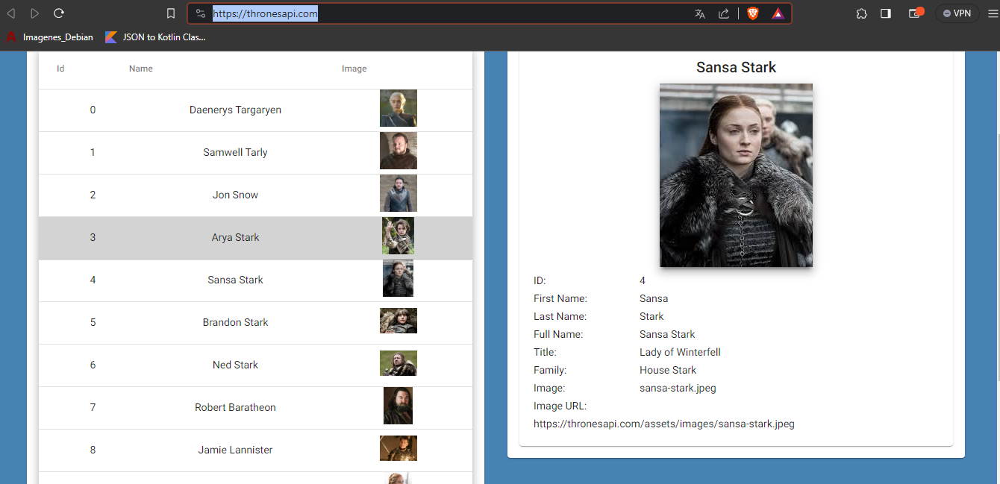
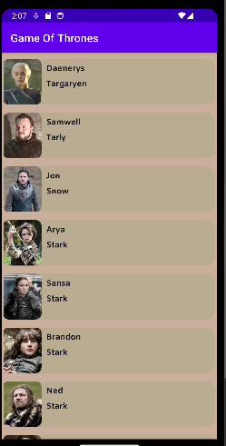
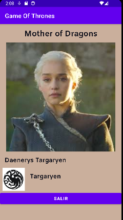
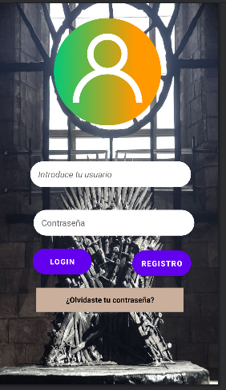

# Práctica 2

## Objetivo
Diseñar una aplicación que consuma una API y contenga un login

## Elementos utilizados
* API de Game of thrones https://thronesapi.com/

## API mínima 
* 23

## Funcionamiento
Dentro del funcionamiento, se logró realizar la implementación del diseño de todos los elementos solicitados, sin embargo, no logré hacer funcionar el login, por lo que el sistema quedó incompleto por esa parte.

A continuación se muestran imágenes del diseño y su funcionamiento:

1. Consumo de la API

2. Detalles del personaje

3. Login (solo diseño)

